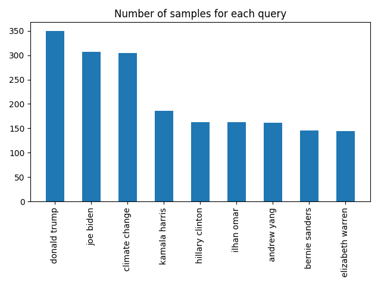

# techandsocietycorpus
The "Tech and Society" corpus documents the behavior of technology products,
with a focus on potential social or political bias.

The *raw data* are to be sampled as *neutrally* as possible. To this, users can
add their own *subjective labels* to the raw data, producing subjective
*labelled data*.

Example code to create statistics from both are also provided.

## Overall Direction
The purpose of this corpus is to document the behavior of various tech
products, so that these can be assessed for their potential social bias or
impact on society.

## Venue
Currently, this corpus exists as a GitHub repository. GitHub is great for
versioning but will not scale indefinitely. A new venue will have to be found
if this corpus is going to hold "big data".

## Data Versions

### v1
The "v1" data import is described in [this json file](data_versions/version1.txt).

It tracks the following queries, sampling once per hour, from 21-July-2019 to
04-Aug-2019:

* "donald trump"
* "joe biden"
* "kamala harris"
* "elizabeth warren"
* "hillary clinton"
* "ilhan omar"
* "andrew yang"
* "bernie sanders"
* "climate change"

The number of samples for each size is depicted here:

Data was collected using a special program running as a "cron job". The server
was not running as any user, and did not pass any cookie data.
